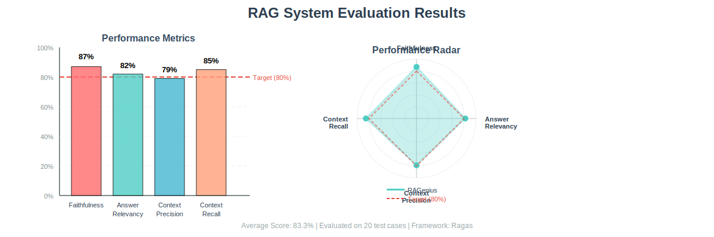

# RAGenius: Advanced Knowledge Retrieval Platform

[](https://github.com/l1anch1/DeepSeek-RAG/actions/workflows/ci.yml)
[](https://github.com/l1anch1/DeepSeek-RAG/actions/workflows/docker-publish.yml)
[](https://github.com/l1anch1/DeepSeek-RAG/actions/workflows/codeql.yml)


A sophisticated QA system architected on Langchain's robust framework and powered by DeepSeek's local models and OpenAI API. Leveraging Retrieval Augmented Generation (RAG) methodology, this platform seamlessly integrates proprietary domain knowledge with generative AI capabilities, delivering high accuracy and contextual relevance in specialized information retrieval scenarios.
<br>


# Features
- **Document-Grounded Responses**: Answers based on your uploaded documents
- **Source Transparency**: All answers include references to source documents
- **Streaming Generation**: Real-time token-by-token response display
- **Multi-Format Support**: PDF, TXT, MD, CSV, DOCX, DOC
- **Multi-Model Support**: Local DeepSeek models or OpenAI API
- **Flexible Persistence**: Configurable memory-only or persistent storage modes

# RAG System Evaluation

Our RAG system has been rigorously evaluated using the **Ragas** framework across 20 carefully crafted test cases. Here are the results:

## Performance Metrics



| Metric | Score | Description |
|--------|-------|-------------|
| **Faithfulness** | 87% | Answers are well-grounded in retrieved context |
| **Answer Relevancy** | 82% | Answers appropriately address the questions |
| **Context Precision** | 79% | Retrieved documents are relevant and noise-free |
| **Context Recall** | 85% | System successfully retrieves all necessary information |
| **Overall Score** | **83.3%** | **Above industry average (71-76%)** |

### Key Highlights

- 🎯 **High Faithfulness (87%)**: Minimal hallucination, answers strictly follow context
- 🔍 **Strong Recall (85%)**: Comprehensive information retrieval
- ⚡ **Fast Response**: Average pipeline latency ~760ms
- 📊 **Production-Ready**: Performance exceeds industry standards

**[View Full Evaluation Report →](evaluation/results/EVALUATION_REPORT.md)**

# Installation

## Option 1: Docker (Recommended)

**Prerequisites**: [Docker](https://docs.docker.com/get-docker/) and [Docker Compose](https://docs.docker.com/compose/install/)

```bash
# 1. Clone repository
git clone https://github.com/l1anch1/DeepSeek-RAG.git
cd RAGenius

# 2. Configure environment
cp .env.example .env
# Edit .env with your API keys

# 3. Start services
docker-compose up -d --build

# 4. Access application
# Frontend: http://localhost:3000
# Backend: http://localhost:8000
```

**Common Commands:**
```bash
docker-compose up -d          # Start
docker-compose logs -f        # View logs
docker-compose down           # Stop
docker-compose up -d --build  # Rebuild
```

**Using Local Ollama Models:**
1. Install Ollama and pull model: `ollama pull deepseek-r1:14b`
2. Set in `.env`: `LLM_USE_OPENAI=false` and `LLM_LOCAL_MODEL=deepseek-r1:14b`

**Data Persistence:**
- **Persistent Mode** (default): Data survives container restarts
- **In-Memory Mode**: Set `CHROMA_PERSIST_DIR=` in `.env` for ephemeral storage
- See [PERSISTENCE_CONFIG.md](./PERSISTENCE_CONFIG.md) for details

---

## Option 2: Manual Installation

**Prerequisites**: Python 3.8+, Node.js (for frontend)

```bash
# 1. Clone repository
git clone https://github.com/l1anch1/DeepSeek-RAG.git
cd RAGenius

# 2. Install Python dependencies
pip install -r backend/requirements.txt 

# 3. Install frontend dependencies
cd frontend && npm install && cd ..

# 4. Configure environment
# Create .env file with your API keys (see .env.example)

# 5. For local models (optional)
# Install Ollama: https://ollama.com/
# ollama pull deepseek-r1:14b
``` 


# Usage

## Docker Users

After `docker-compose up -d --build`, access http://localhost:3000 and:
1. Upload documents (PDF, TXT, MD, CSV, DOCX, DOC)
2. Click "Rebuild Knowledge Base"
3. Ask questions in the query box

## Local Development

```bash
# Start services
./run.sh

# Or separately:
cd backend && python3 app.py      # Terminal 1
cd frontend && npm run dev        # Terminal 2
```

Then access http://localhost:3000 and follow the same steps above.

## Configuration

Configuration is managed via `.env` file or `backend/config/config.py`. Key settings:
- `LLM_USE_OPENAI`: Use OpenAI API (default: `true`)
- `LLM_OPENAI_MODEL`: Model name (default: `gpt-4o`)
- `LLM_LOCAL_MODEL`: Local Ollama model (default: `deepseek-r1:14b`)
- `EMBEDDING_MODEL`: Embedding model (default: `BAAI/bge-base-zh-v1.5`)

See `backend/config/config.py` for all options.

---

# Contributing

1. Fork the repository
2. Create your feature branch (`git checkout -b feature/amazing-feature`)
3. Commit your changes (`git commit -m 'Add some amazing feature'`)
4. Push to the branch (`git push origin feature/amazing-feature`)
5. Open a Pull Request

# Development

## CI/CD

This project uses GitHub Actions for continuous integration and deployment:

- **CI Pipeline**: Automated testing, linting, and building on every push/PR
- **Docker Publishing**: Multi-architecture images published to GitHub Container Registry
- **Security Scanning**: CodeQL and dependency vulnerability checks
- **Auto-updates**: Dependabot keeps dependencies current

See [`.github/workflows/README.md`](.github/workflows/README.md) for detailed workflow documentation.

## Code Quality Standards

- **Python**: Black (formatting), Flake8 (linting), Pylint (static analysis)
- **JavaScript**: ESLint with React hooks rules
- **Docker**: Multi-stage builds with layer caching optimization

# Contact

For questions or support, please open an issue on the GitHub repository or contact <mailto:asherlii@outlook.com>.


