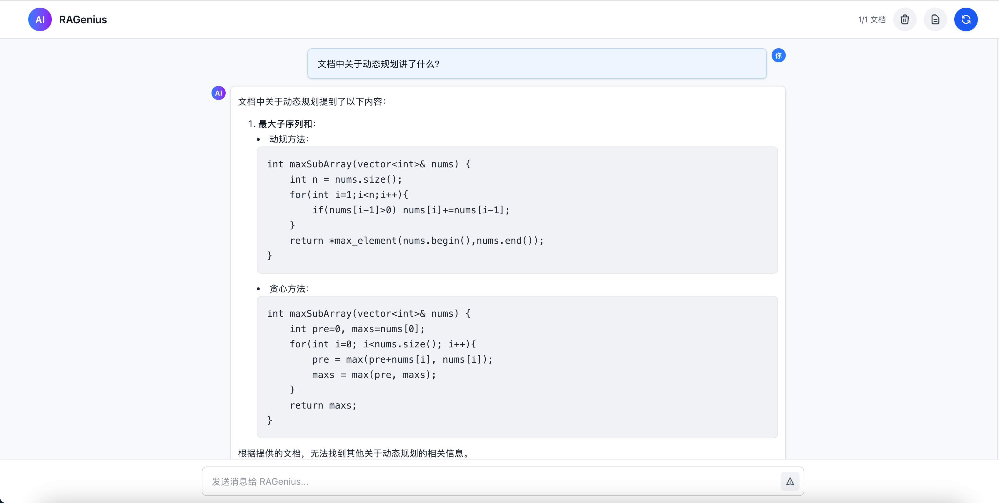

# RAGenius: Advanced Knowledge Retrieval Platform

A sophisticated QA system architected on Langchain's robust framework and powered by DeepSeek's large language models and OpenAI API. Leveraging Retrieval Augmented Generation (RAG) methodology, this platform seamlessly integrates proprietary domain knowledge with generative AI capabilities, delivering high accuracy and contextual relevance in specialized information retrieval scenarios.
<br>




# Features
- Document-Grounded Responses: DeepSeek learns from your documents to provide better, more accurate answers
- Source Transparency: All answers include references to source documents for verification
- Streaming Generation: Real-time response generation with token-by-token display
- Easy Document Management: Simple interface to manage your knowledge base
- Multi-Model Support: Choose between local DeepSeek models or OpenAI API models like GPT-4

# Requirements
- Python 3.8+
- For local models:
  - Ollama installed and configured
  - DeepSeek model pulled in Ollama
  - At least 16GB RAM recommended (32GB for optimal performance)
  - GPU acceleration recommended but not required
- For OpenAI API:
  - OpenAI API key (can be set as environment variable)
  - Internet connection for API access

# Structure
```
RAGenius
├─ backend
│  ├─ app.py
│  ├─ config.py
│  ├─ container.py
│  ├─ interfaces
│  │  ├─ services.py
│  │  └─ vector_store.py
│  ├─ managers
│  │  ├─ cache_manager.py
│  │  ├─ model_manager.py
│  │  └─ vector_store_manager.py
│  ├─ services
│  │  ├─ document_service.py
│  │  ├─ query_service.py
│  │  └─ system_service.py
│  ├─ models_cache
│  ├─ prompts.py
│  ├─ requirements.txt
│  └─ routes
│     ├─ documents.py
│     ├─ query.py
│     └─ system.py
├─ models_cache
├─ frontend
│  ├─ public
│  │  ├─ images
│  │  │  ├─ 1.png
│  │  │  └─ 2.png
│  │  └─ vite.svg
│  └─ src
│     ├─ App.css
│     ├─ App.jsx
│     ├─ assets
│     ├─ components
│     │  ├─ IntegratedTab.jsx
│     │  └─ KnowledgeBase.jsx
│     ├─ index.css
│     └─ main.jsx
├─ run.sh
├─ scripts
│  └─ test_model.py
└─ README.md
```

# Installation

## Option 1: Docker (Recommended)

The easiest way to run RAGenius is with Docker. No need to install Python, Node.js, or manage dependencies manually.

### Prerequisites
- [Docker](https://docs.docker.com/get-docker/) installed
- [Docker Compose](https://docs.docker.com/compose/install/) installed

### Quick Start

1. Clone the repository:
```bash
git clone https://github.com/l1anch1/DeepSeek-RAG.git
cd RAGenius
```

2. Copy the environment example and configure:
```bash
cp .env.example .env
# Edit .env with your settings (API keys, etc.)
```

3. Build and start the containers:
```bash
docker-compose up -d --build
```

4. Access the application:
   - Frontend: http://localhost:3000
   - Backend API: http://localhost:8000

### Docker Commands

```bash
# Start services
docker-compose up -d

# View logs
docker-compose logs -f

# Stop services
docker-compose down

# Rebuild after code changes
docker-compose up -d --build

# Clean up (including volumes)
docker-compose down -v
```

### Using Local Ollama Models with Docker

If you want to use local Ollama models instead of OpenAI API:

1. Install and run Ollama on your host machine
2. Pull your desired model: `ollama pull deepseek-r1:14b`
3. Set in `.env`:
   ```
   LLM_USE_OPENAI=false
   LLM_LOCAL_MODEL=deepseek-r1:14b
   ```
4. The Docker container will connect to Ollama via `host.docker.internal`

---

## Option 2: Manual Installation

1. Clone the repository:
```bash
git clone https://github.com/l1anch1/DeepSeek-RAG.git
cd RAGenius
```
 
2. Create and activate a virtual environment (recommended):
```bash
conda create -n deepseek-rag python=3.9
conda activate deepseek-rag
``` 

3. Install dependencies:
```bash
pip install -r backend/requirements.txt 
``` 

4. For local models, install Ollama following instructions at <https://ollama.com/>

5. Pull the DeepSeek model if using locally:
```bash
ollama pull deepseek-r1:14b
``` 
6. For OpenAI API, set your API key and base url(optional) as environment variables in a `.env` file or in your system environment


# Usage
1. First, test your LLM model connection:
```
# For local DeepSeek model
python ./scripts/test_model.py

# For OpenAI API
python ./scripts/test_model.py --use-openai
``` 

2. Upload your documents through the web interface 

| Format | Support |
|--------|---------|
| PDF    | ✓       |
| TXT    | ✓       |
| MD     | ✓       |
| CSV    | ✓       |
| DOCX   | ✓       |
| DOC    | ✓       |

3. Start the web application:
```
./run.sh
```

Alternatively, you can start the backend and frontend separately:
```
# Start backend
cd backend
python app.py

# Start frontend (in another terminal)
cd frontend
npm run dev
```

4. Open your browser and visit http://localhost:3000

5. Upload documents using the "Upload File" button in the document management sidebar

6. Click `Rebuild Knowledge Base` to process your documents

7. Ask questions in the query box and receive document-grounded answers

## Command Line Arguments
| Argument | Description | Default |  
|----------|-------------|---------|  
| `--port` | Port for the web service | 5000 |  
| `--use-openai` | Use OpenAI API instead of local model | False |  
| `--embedding-model` | Embedding model for document indexing | BAAI/bge-base-zh-v1.5 |  
| `--num-threads` | Number of threads for processing | 12 |  


# Developer Guide
If you want to contribute to the project, please follow these steps:
1. Fork the repository
2. Create your feature branch (`git checkout -b feature/amazing-feature`)
3. Commit your changes (`git commit -m 'Add some amazing feature'`)
4. Push to the branch (`git push origin feature/amazing-feature`)
5. Open a Pull Request


# Contact
For questions or support, please open an issue on the GitHub repository or contact the maintainer at <mailto:asherlii@outlook.com>.


