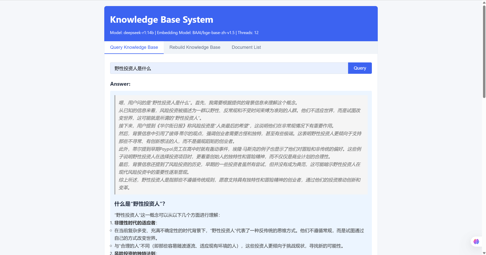
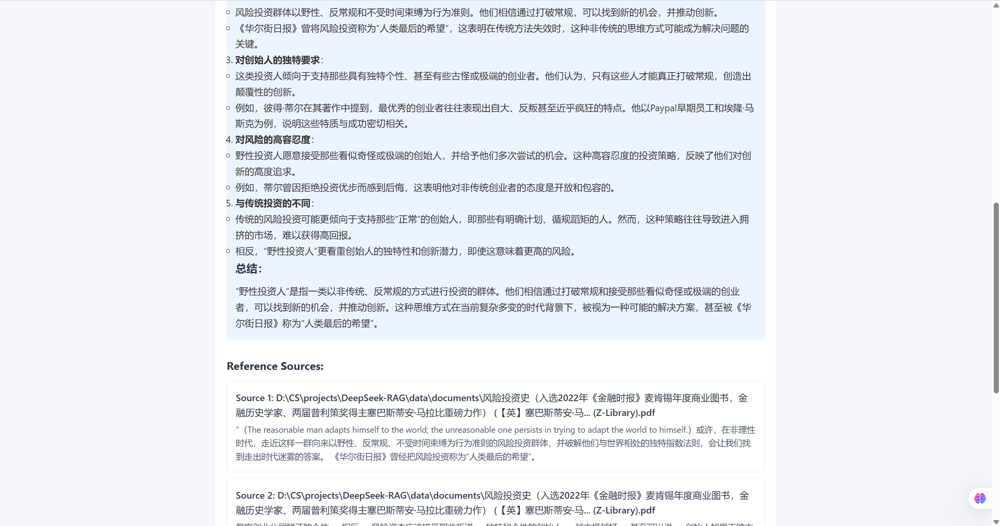

# DeepSeek-RAG: Advanced Knowledge Retrieval Platform

A sophisticated QA system architected on Langchain's robust framework and powered by DeepSeek's large language models. Leveraging Retrieval Augmented Generation (RAG) methodology, this platform seamlessly integrates proprietary domain knowledge with generative AI capabilities, delivering high accuracy and contextual relevance in specialized information retrieval scenarios.
<br>



# Features
- Document-Grounded Responses: DeepSeek learns from your documents to provide better, more accurate answers
- Source Transparency: All answers include references to source documents for verification
- Streaming Generation: Real-time response generation with token-by-token display
- Easy Document Management: Simple interface to manage your knowledge base


# Requirements
- Python 3.8+
- Ollama installed and configured
- DeepSeek-r1:14b model pulled in Ollama
- At least 16GB RAM recommended (32GB for optimal performance)
- GPU acceleration recommended but not required

# Structure
```
deepseek-rag
│
├── app/
│ ├── core/
│ │ ├── model_utils.py 
│ │ ├── document_processor.py 
│ │ ├── shared_instances.py
│ │ └── retrieval_chain.py
│ │
│ └── config.py 
│
├── web/                    
│ ├── static/  
│ │ ├── style.css  
│ │ └── script.js 
│ │
│ └── templates/
│   └── index.html 
│
├── data/
│ ├── documents 
│ └── vectordb 
│
├── scripts/
│ └── test_model.py
│
├── assets/
│ └── images
|
├── web_app.py 
│
└── requirements.txt 
```

# Installation
1. Clone the repository:
```
git clone https://github.com/l1anch1/DeepSeek-RAG.git
cd DeepSeek-RAG
```
 
2. Create and activate a virtual environment (recommended):
```
conda create -n deepseek_rag python=3.11
conda activate deepseek_rag
``` 

3. Install dependencies:
```
pip install -r requirements.txt 
``` 

4. Install Ollama following instructions at <https://ollama.com/>

5. Pull the DeepSeek model:
```
ollama pull deepseek-r1:14b
``` 

# Usage
1. First, test your DeepSeek model connection:
```
python ./scripts/test_model.py
``` 

2. Place your documents in the data/documents directory

| Format | Support |
|--------|---------|
| PDF    | ✓       |
| TXT    | ✓       |
| CSV    | ✓       |

3. Start the web application:
```
python web_app.py
```

4. Open your browser and visit http://localhost:5000

5. Click `Rebuild Knowledge Base` to process your documents

6. Ask questions in the query box and receive document-grounded answers


# Developer Guide
If you want to contribute to the project, please follow these steps:
1. Fork the repository
2. Create your feature branch (`git checkout -b feature/amazing-feature`)
3. Commit your changes (`git commit -m 'Add some amazing feature'`)
4. Push to the branch (`git push origin feature/amazing-feature`)
5. Open a Pull Request


# Contact
For questions or support, please open an issue on the GitHub repository or contact the maintainer at <mailto:asherlii@outlook.com>.