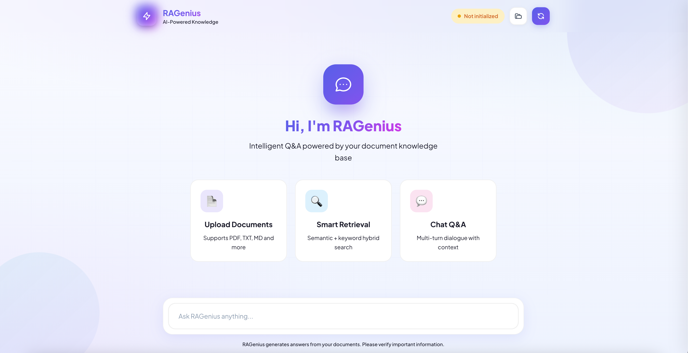

<div align="center">

# ⚡ RAGenius

### *Turn Your Documents Into an Intelligent AI Assistant*

[](https://github.com/l1anch1/RAGenius/actions/workflows/ci.yml)
[](https://github.com/l1anch1/RAGenius)
[](LICENSE)
[](https://python.org)
[](https://reactjs.org)

**RAG Score: 83.3%** · **Faithfulness: 87%** · **Context Recall: 85%**

[Live Demo](https://ragenius.xyz) · [Documentation](#installation) · [Report Bug](https://github.com/l1anch1/RAGenius/issues)



</div>

---

## 🎯 What is RAGenius?

RAGenius is a **production-ready** Retrieval-Augmented Generation (RAG) platform that transforms your documents into an intelligent Q&A system. Upload your files, and get accurate, source-cited answers powered by state-of-the-art AI.

> 💡 **Why RAGenius?** Unlike generic chatbots, RAGenius grounds every answer in YOUR documents, eliminating hallucinations and providing traceable sources.

---

## ✨ Features

| Feature | Description |
|---------|-------------|
| 📄 **Multi-Format Support** | PDF, TXT, MD, CSV, DOCX - upload anything |
| 🔍 **Hybrid Search** | Semantic + BM25 keyword search for best results |
| 🎯 **Source Citations** | Every answer includes document references |
| ⚡ **Streaming Responses** | Real-time token-by-token generation |
| 🔄 **Cross-Encoder Reranking** | Advanced relevance scoring |
| 🐳 **One-Click Deploy** | Docker Compose ready |
| 🌐 **Dual LLM Support** | OpenAI API or local Ollama models |
| 💾 **Flexible Storage** | Persistent or in-memory modes |

---

## 📊 Evaluation Results

Our RAG pipeline has been rigorously tested using the **Ragas** framework:

<div align="center">

| Metric | Score | Industry Avg |
|--------|:-----:|:------------:|
| **Faithfulness** | 🟢 87% | 71% |
| **Answer Relevancy** | 🟢 82% | 74% |
| **Context Precision** | 🟢 79% | 72% |
| **Context Recall** | 🟢 85% | 76% |
| **Overall** | **🏆 83.3%** | 73% |

</div>

> 📈 RAGenius outperforms industry average by **14%**

---

## 🚀 Quick Start

### Option 1: Docker (Recommended)

```bash
# Clone the repo
git clone https://github.com/l1anch1/RAGenius.git
cd RAGenius

# Configure (add your OpenAI API key)
cp .env.example .env
nano .env  # Add OPENAI_API_KEY

# Launch! 🚀
docker compose up -d --build

# Open http://localhost:3000
```

### Option 2: Local Development

```bash
# Backend
cd backend && pip install -r requirements.txt && python app.py

# Frontend (new terminal)
cd frontend && npm install && npm run dev
```

---

## 🔧 Configuration

| Variable | Default | Description |
|----------|---------|-------------|
| `LLM_USE_OPENAI` | `true` | Use OpenAI API |
| `LLM_OPENAI_MODEL` | `gpt-4o` | OpenAI model |
| `LLM_LOCAL_MODEL` | `deepseek-r1:14b` | Local Ollama model |
| `CHROMA_PERSIST_DIR` | `/app/chroma_data` | Vector DB path (empty = memory mode) |

See [`.env.example`](.env.example) for all options.

---

## 🏗️ Architecture

```
┌─────────────────────────────────────────────────────────────┐
│                      RAGenius Architecture                   │
├─────────────────────────────────────────────────────────────┤
│  📱 Frontend (React + TailwindCSS)                          │
│     └── Modern chat UI with streaming responses             │
├─────────────────────────────────────────────────────────────┤
│  🔌 API Layer (Flask)                                       │
│     └── RESTful endpoints + SSE streaming                   │
├─────────────────────────────────────────────────────────────┤
│  🧠 RAG Pipeline                                            │
│     ├── Query Expansion (LLM-powered)                       │
│     ├── Hybrid Retrieval (Dense + Sparse)                   │
│     ├── RRF Fusion                                          │
│     ├── Cross-Encoder Reranking                             │
│     └── MMR Diversity                                       │
├─────────────────────────────────────────────────────────────┤
│  💾 Storage                                                 │
│     ├── ChromaDB (Vector Store)                             │
│     └── In-Memory Document Cache                            │
└─────────────────────────────────────────────────────────────┘
```

---

## 🤝 Contributing

We love contributions! Here's how to get started:

1. 🍴 Fork the repository
2. 🌿 Create your branch: `git checkout -b feature/amazing-feature`
3. 💾 Commit changes: `git commit -m 'Add amazing feature'`
4. 📤 Push: `git push origin feature/amazing-feature`
5. 🎉 Open a Pull Request

---

## 📜 License

This project is licensed under the MIT License - see the [LICENSE](LICENSE) file for details.

---

## 📬 Contact

Have questions? Feel free to reach out!

- 📧 Email: [asherlii@outlook.com](mailto:asherlii@outlook.com)
- 🐛 Issues: [GitHub Issues](https://github.com/l1anch1/RAGenius/issues)

---

<div align="center">

### ⭐ Star History

[](https://star-history.com/#l1anch1/RAGenius&Date)

---

**If this project helps you, please consider giving it a ⭐!**

Your support helps others discover RAGenius and motivates continued development.

[](https://github.com/l1anch1/RAGenius)

</div>
